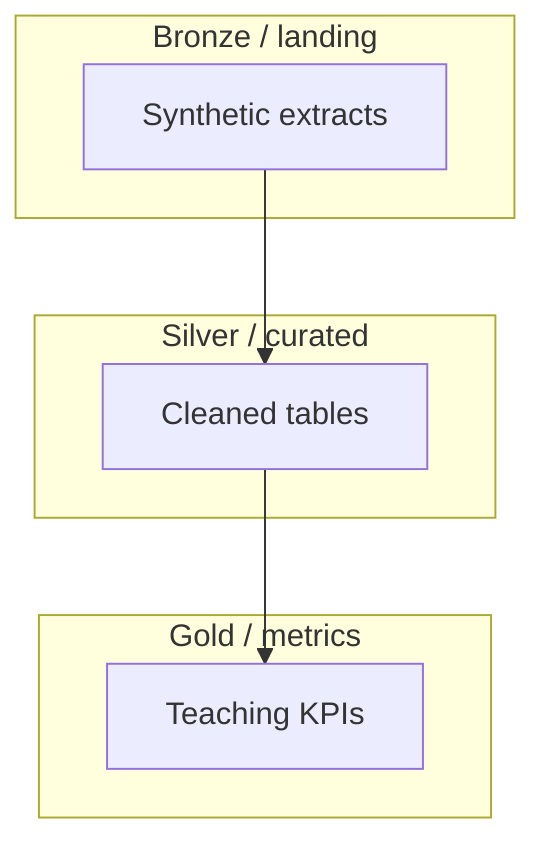

# Architecture — Trino / Starburst Federation Lab

Synthetic extract → local transform → teaching KPIs.

```mermaid
flowchart TB
  subgraph bronze [Bronze / landing]
    RAW[Synthetic extracts]
  end
  subgraph silver [Silver / curated]
    CUR[Cleaned tables]
  end
  subgraph gold [Gold / metrics]
    M[Teaching KPIs]
  end
  RAW --> CUR --> M
```

All paths run locally. Cloud product names describe **patterns** only.

